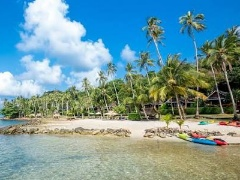
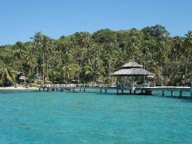
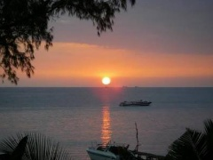

# Mice tourizm на острове Ко Куд. Тайланд
## Помощь в организации любого мероприятия на остове Куд

* Трансфер,
* Размещение,
* Организация отдыха,
* Услуги персонального гида и переводчика,
* Помощь при выборе отеля,
* Консультация любых вопросов, связанных с островом,
* Мы можем выступить в роли Вашего представителя на месте.

## Почему Ко Куд?

* Круглый год лето, солнце, фрукты
* Нет пыли,суеты и шума
* Кристально чистое море, самые красивые закаты, белоснежные пляжи, богатая флора и фауна.
* Приветливая и дружелюбная обстановка
* Полная отключка от внешнего мира.
* Возможность размещения от бюджетного до эксклюзивного.
* Отличный спектр развлечений (дайвинг, снорклинг,рыбалка, треккинг,каякинг,посищение водопада,тайский массаж).
* Удобное расположение острова,различные способы трансфера из Бангкока(самолет, такси, автобус,минивэн).
* Безвизовый режим для россиян до 30 дней.

## Немного об острове:

   Чем же остров Ко Куд
отличается от остальных
многочисленных  островов Таиланда, что
его с каждым  годом стремятся посетить
все больше и больше людей? Многие
отвечают просто: «Когда  вы приедете на
Ко Куд, то вы поймете все сами». Одним
словом Ко Куд – это место покоя, 
созерцания и расслабления, место
восстановления и обновления. Каждый
закат романтичен, красив и не повторим.
Приехав на Ко Куд, Ваши клиенты смогут
отдохнуть и душой и телом,
почувствовать единение с природой,
насладиться ёе чистотой и
первозданностью.Богатый подводный мир
подарит незабываемые впечатления
любителям сноркелинга и дайвинга. На 
острове имеется госпиталь, полицейский
участок, государственные школы,
административные учреждения, банк и
банкомат и множество ресторанов
тайской кухни, где Вам могут предложить
свежайшие морепродукты. Без сомнений,
Остров Куд- это отличное место для
организации тренингов,
тимбилдинга,поощерительных поездок,
частных и корпоративных мероприятий,
проведения свадебных церемоний.

## Кто Я

   Креативный, энергичный проффессионал , 
работающий в сфере туризма более 10 лет,
знающий историю, культуру и  быт Тайланда.
Я говорю на  тайском и
английском языках, так что помочь 
организовать любое мероприятие не
составит для меня никаких сложностей.  Находясь
на острове Куд более 4 лет, я хорошо изучила 
его инфаструктуру ,исследовала каждый
красивый уголок и готова познакомить
Вас и Ваших партнеров с этим удивительным
островом. У меня есть опыт в
организации на острове тренингов
личностного роста, детских
оздоровительных семинаров, свадебных
церемоний,
йога-туров,научно-исследовательских
работ(ознакомление детей с культурой
Тайланда), корпоративнного отдыха.

Подарите Вашим партнером кусочек Рая!!!!

## фото

## адрес

