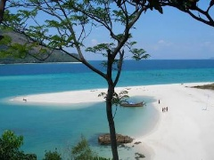
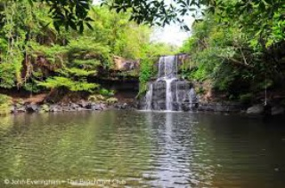
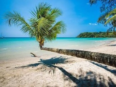
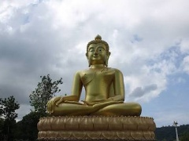
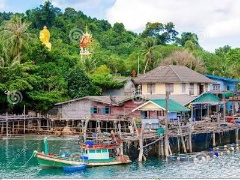

# Mice tourizm на острове Ко Куд. Тайланд

## Помощь и содействие в организации мероприятии на острове Ко Куд

* Трансфер
* Размещение
* Организация отдыха
* предоставление любой необходимой инфраструктуры
* Услуги персонального гида и переводчика
* Помощь при выборе отеля
* Быстрое и эффективное решение проблем и вопросов
* Мы можем выступить в роли Вашего представителя на месте
* Любая информация и консультация связанная с островом

## Почему Ко Куд?

* Круглый год лето, солнце, фрукты
* Нет пыли, суеты и шума
* Кристально чистое море, самые красивые закаты, белоснежные пляжи, богатая флора и фауна
* Приветливая и дружелюбная обстановка
* Отличная возможность уйти от проблем внешнего мира
* Возможность размещения от бюджетного до эксклюзивного
* Отличный спектр развлечений (дайвинг, снорклинг, каякинг, рыбалка, тайский массаж, трекинг: водопады / джунгли и многое другое )
* Удобное расположение острова, различные способы трансфера из Бангкока (самолет, такси, автобус, минивэн)
* Безвизовый режим для россиян до 30 дней

## Немного об острове

Чем же остров Ко Куд отличается от остальных
многочисленных  островов Таиланда, что
его с каждым  годом стремятся посетить
все больше и больше людей? Многие
отвечают просто: «Когда  вы приедете на
Ко Куд, то вы поймете все сами». Одним
словом Ко Куд – это место покоя, 
созерцания и расслабления, место
восстановления и обновления. Каждый
закат романтичен, красив и неповторим.
Приехав на Ко Куд, Ваши клиенты смогут
отдохнуть и душой и телом,
почувствовать единение с природой,
насладиться ёе чистотой и
первозданностью и в этой благоприятной атмосфере 
решить все необходимые вопросы. Богатый подводный мир
подарит незабываемые впечатления
любителям сноркелинга и дайвинга. На 
острове имеется госпиталь, полицейский
участок, государственные школы,
административные учреждения, банк и
банкомат и множество ресторанов
тайской кухни, где Вам могут предложить
свежайшие морепродукты. Без сомнений,
Остров Куд- это отличное место для
организации тренингов,
тимбилдинга,поощерительных поездок,
частных и корпоративных мероприятий,
проведения свадебных церемоний.

## Кто Я

Креативный, энергичный профессионал , 
работающий в сфере туризма более 10 лет
(не только в Тайланде),
знающий историю, культуру и  быт Тайланда.
Я говорю на  тайском и
английском языках, так что помочь 
организовать любое мероприятие не
составит для меня никаких сложностей.  Находясь
на острове Куд более 4 лет, я хорошо изучила 
инфраструктуру острова,исследовала каждый
красивый уголок и готова познакомить
Вас и Ваших партнеров с этим удивительным
местом. У меня есть опыт в
организации на острове тренингов
личностного роста, детских
оздоровительных программ, свадебных
церемоний,
йога-туров,научно-исследовательских
работ(ознакомление детей с культурой
Тайланда), корпоративного отдыха.

## Фото:

## Порадуйте Ваших клиентов

## Адрес:

* Banklongnamsai Moo1. Koh Kood, Trat, 23000
* skype:abelimova
* tel: +66643377650
* e-mail: abelimova@yandex.ru
  anbeal21@gmail.com
